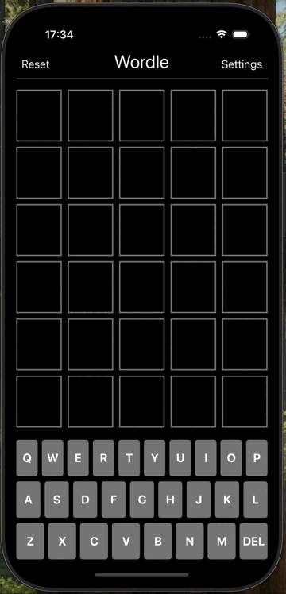

# Project 2 - *Project2 Wordle*

Submitted by: **Mary Ramirez**

**Project2 Wordle** is a game where you try to guess a secret word within a limited number of tries. Each time you make a guess, the game gives you hints showing which letters are in the word and whether they are in the correct positions. Your goal is to use these clues to figure out the secret word before you run out of guesses. Also, it allows the user access to the  settings screen and modify the rules of the game.

Time spent: **15** hours spent in total

## Required Features

The following **required** functionality is completed:

- [X] User can change the number of letters per row (the length of the goal word)
- [X] User can change the numbers of rows on the board (how many guesses allowed)
- [X] User can select a new themed set to pull the goal word from
- [X] User can select "alien wordle", causing the goal word to change after each guess

The following **optional** features are implemented:

- [ ] App displays a reset button on the top left to reset the game (but make no changes to the settings)

The following **additional** features are implemented:

- [ ] List anything else that you can get done to improve the app functionality!

## Video Walkthrough

## Notes

Describe any challenges encountered while building the app.

## License

    Copyright [2025] [Mary Ramirez]

    Licensed under the Apache License, Version 2.0 (the "License");
    you may not use this file except in compliance with the License.
    You may obtain a copy of the License at

        http://www.apache.org/licenses/LICENSE-2.0

    Unless required by applicable law or agreed to in writing, software
    distributed under the License is distributed on an "AS IS" BASIS,
    WITHOUT WARRANTIES OR CONDITIONS OF ANY KIND, either express or implied.
    See the License for the specific language governing permissions and
    limitations under the License.
